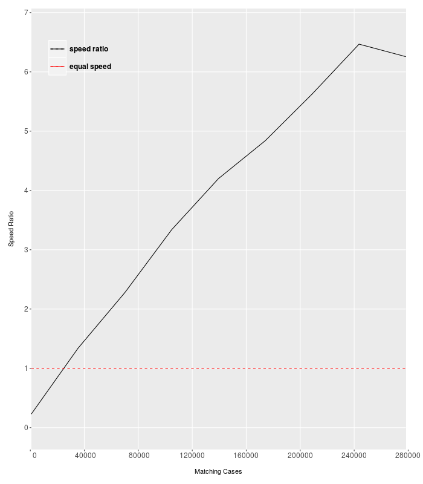
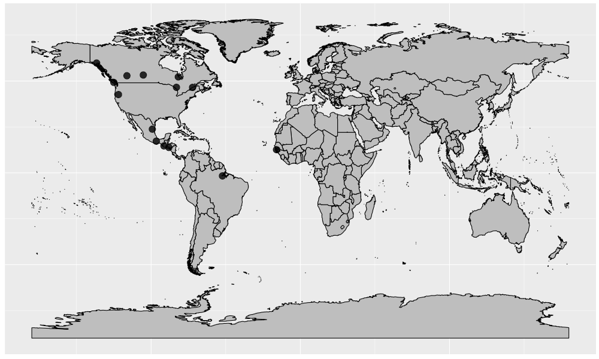

<style>
    body {
          max-width: 1000px;
          margin: auto;
          padding: 5em;
          line-height: 2x; 
    }
</style>

```{r set-options, include = FALSE, cache=FALSE}
knitr::opts_chunk$set(
  collapse = TRUE,
  comment = "#>"
)
```

# {.tabset}

## Overview

As data analysts, there are a myriad of daily tasks which seem simple, but yet hide complex computational requirements. These are the kind of challenges that weencounter that are not entirely part of our main objective, but need to be overcome nonetheless. These include, but are not limited to, conducting complicated string searches, querying spatial information and sometimes just organizing messy data.

This package aims to offer useful functions for data analysts which might help in making these "on-the-fly" tasks lighter and more automated. 

Demystas functions can be broken up into two main categories:

1. **greps-type** functions
2. **spatial queries and vector enumeration** functions

Feel free to navigate these categories through the tags above.

## greps-type functions {.tabset}

greps-style functions form a key aspect of the `demystas` package. These functions assist with matching vectors of strings or keywords in order to deliver the best possible matchings. The three greps-style functions that we offer are:

1. `greps`: sequential string mapping
2. `grepsParallel`: parallel string mapping for large vectors
3. `grepsAbb`: sequential abbrevation to complete word mapping

### **1. `greps` function**

#### **Basic functionality**

Assume we have two vectors containing strings, here `x` and `y`.These vectors are included in the `/inst/extdata` directory of this R package and can be accessed as such:

```{r, echo=TRUE, eval=TRUE}
x <- read.csv(system.file("extdata", "sample1.csv", package = "demystas"), stringsAsFactors = FALSE)[337:347,1]

y <- read.csv(system.file("extdata", "sample2.csv", package = "demystas"), stringsAsFactors = FALSE)[c(29:35,553,737),1]
```

`x` shows an excerpt of a model's input data (e.g. REMIND). `y` represents an excerpt of REMIND model output. Our goal is to create some mappings from `x` to `y` in order to compare parameters and conduct validations. 

Here is what `x` and `y` look like:

```{r, echo=FALSE, results='asis'}
new <- data.frame(matrix(ncol = 2, nrow = 0))
new[1:length(x),1] <- x
new[1:length(y),2] <- y
names(new) <- c("x", "y")
knitr::kable(new)
```

Here, we can see keywords in `x` are separated by the character `"."` and keywords in `y` are separated by the character `"|"`. We can input these parameters into the `greps` function as regex-style expressions.

```{r, echo=TRUE, eval = FALSE}
test <- demystas::greps(x, y, sepx = "\\.", sepy = "\\|")
```

The functions produces a list with 2 matrices. The first matrix contains mappings from `x` to `y` and the second contains the respective matching scores in descending order for easy reading. Take a look:

```{r, echo=FALSE, results='hide'}
test <- demystas::greps(x, y, sepx = "\\.", sepy = "\\|")
```
```{r, echo=TRUE, eval = FALSE, results='markup'}
View(test[[1]])
```
```{r, echo=FALSE, results='asis'}
knitr::kable(test[[1]])
```
```{r, echo=TRUE, eval = FALSE, results='markup'}
View(test[[2]])
```
```{r, echo=FALSE, results='asis'}
knitr::kable(test[[2]])
```

With these results, a human could then begin parsing the data row-by-row in order to select truly relevant or similar mappings. This algorithm naturally cannot provide a complete solution for mapping purposes, but it narrows down the search space for a human to do the more "intelligent" work.

#### **Advanced functionality**

The `greps` functions contains some parameters to tweak the matching process based on the user's perspective. The key parameters are:

a. `limitWord`: a numerical threshold greater than or equal to 0 for entire keyword matching
b. `limitChar`: a numerical threshold between 0 and 1 for string subset-based matching
c. `wordIgnore`: a character vector of strings which should be ignored for the matching process
d. `booster`: a numerical threshold which boosts the score of well-matched sub-strings. This value should be greater than `limitChar` to provide meaningful results.
e. `checkBoth`: a logical indicating whether both left and right grep-analyses should be conducted 
f. `ignore.case`: a logical indicating if the R internal grep function should match strings by ignoring cases

For brevity, we will go through `limitWord`, `limitChar` and `wordIgnore`.

##### **a. `limitWord`**

As per the previous example, if we want to filter keywords which have a matching score greater than `0.17`, we can execute the following:

```{r, echo=TRUE, eval = FALSE}
test <- demystas::greps(x, y, sepx = "\\.", sepy = "\\|", limitWord = 0.17)
```
```{r, echo=FALSE, results='hide'}
test <- demystas::greps(x, y, sepx = "\\.", sepy = "\\|", limitWord = 0.17)
```
```{r, echo=TRUE, eval = FALSE, results='markup'}
View(test[[1]])
```
```{r, echo=FALSE, results='asis'}
knitr::kable(test[[1]])
```
```{r, echo=TRUE, eval = FALSE, results='markup'}
View(test[[2]])
```
```{r, echo=FALSE, results='asis'}
knitr::kable(test[[2]])
```

Here, we see a smaller matrix of matchings with matching scores above 0.17. This might be useful for filtering purposes.

##### **b. `limitChar`**

As per the result above, we notice that "Xport.seel.waste" matches to "Emi|SO2|Land Use|Agricultural Waste Burning" due to the substring "waste" matching the substring "Agricultural Waste Burning" respectively. In our perspective, this would be considered a redundant match and we would want to remove such cases. To do this, we can set the threshold for string-subset matchings to be higher. This corresponds to the `limitChar` parameter.

In this case, we can increase `limitChar` from its default value of 0 to 0.5.

```{r, echo=TRUE, eval = FALSE}
test <- demystas::greps(x, y, sepx = "\\.", sepy = "\\|", limitWord = 0.17, limitChar = 0.5)
```
```{r, echo=FALSE, results='hide'}
test <- demystas::greps(x, y, sepx = "\\.", sepy = "\\|", limitWord = 0.17, limitChar = 0.5)
```
```{r, echo=TRUE, eval = FALSE, results='markup'}
View(test[[1]])
```
```{r, echo=FALSE, results='asis'}
knitr::kable(test[[1]])
```
```{r, echo=TRUE, eval = FALSE, results='markup'}
View(test[[2]])
```
```{r, echo=FALSE, results='asis'}
knitr::kable(test[[2]])
```

Consequently, we observe that the redundant "Emi|SO2|Land Use|Agricultural Waste Burning" match disappears.

**Note: The user should be conservative with the `limitChar` and `limitWord` values, as high values can also result in no matchings at all!**

##### **c. `wordIgnore`**

We can notice here that the top match for components such as "Xport.other" and "Xport.seso.other" is "Energy Investments|Other". This is due to a perfect match of the string "other" on both sides. This would not be necessarily desirable from the human's perspective, since the substring "other" is ambiguous. If we want to stop the algorithm from successfully matching the string "other", we can input this into the `wordIgnore` parameter.

```{r, echo=TRUE, eval = FALSE}
test <- demystas::greps(x, y, sepx = "\\.", sepy = "\\|", limitWord = 0.15, limitChar = 0.5, wordIgnore = c("other"))
```
```{r, echo=FALSE, results='hide'}
test <- demystas::greps(x, y, sepx = "\\.", sepy = "\\|", limitWord = 0.15, limitChar = 0.5, wordIgnore = c("other"))
```
```{r, echo=TRUE, eval = FALSE, results='markup'}
View(test[[1]])
```
```{r, echo=FALSE, results='asis'}
knitr::kable(test[[1]])
```
```{r, echo=TRUE, eval = FALSE, results='markup'}
View(test[[2]])
```
```{r, echo=FALSE, results='asis'}
knitr::kable(test[[2]])
```

With this, we can observe that the matched string "Energy Investments|Other" disappears because its substring "other" is now being ignored, which leads to no successful matching. The resulting matrix produces matchings which are probably more relevant to the human.

### **2. `grepsParallel` function**

The `grepsParallel` function has the exact same functionalities as the `greps` function, except it can be executed in a parallel manner instead of a sequential manner. This is particularly useful for conducting keyword mappings on large vectors sets by reducing the time required for computation. Naturally, this is also useful for execution on a cluster.

The only additional parameter here is `noCores`, where the user specifies the number of cores to be used for parallel computation.

As a simple example, consider the two following vectors `x` and `y`:

```{r, echo=TRUE, eval=FALSE}
x <- read.csv(system.file("extdata", "sample1.csv", package = "demystas"), stringsAsFactors = FALSE)[1:100,1]

y <- read.csv(system.file("extdata", "sample2.csv", package = "demystas"), stringsAsFactors = FALSE)[1:300,1]
```

To match the keywords through our `greps` functions, we need to process 100 x 300 x 2 = 60,000 cases. Here we compare the sequential `greps` functions in `test1` against the parallel `grepsParallel` function in `test2`.

```{r, echo=TRUE, eval=FALSE}
test1 <- demystas::greps(x, y, sepx = "\\.", sepy = "\\|")

test2 <- demystas::grepsParallel(x, y, noCores = 4, sepx = "\\.", sepy = "\\|")
```
```{r, echo=FALSE, results='asis'}
new <- data.frame(matrix(ncol = 3, nrow = 0))
new[1,1] <- "84.441s"
new[1,2] <- "18.761s"
new[1,3] <- 84.441/18.761
names(new) <- c("greps", "grepsParallel", "speedRatio (par:seq)")
knitr::kable(new)
```

In this case given `x` and `y`, we can see that the `grepsParallel` function is ~4.5 times faster than the corresponding `greps` function.

Below, we plotted the execution time required for the sequential `greps` algorithm (red) against that of the parallel `grepsParallel` algorithm (blue). 

We essentially kept `x` at its maximum length and increased the length of `y` incrementally. Here, we can see that the sequential algorithm performs slightly better than the parallel algorithm until ~30,000 matching cases, After this, significant improvements in execution time manifest for the parallel algorithm. 

```{r echo=FALSE, out.width='70%', fig.align='center'}
knitr::include_graphics('./seqVparTime.png')
```

This can also be visualized by the speed ratio (black) of the parallel algorithm compared to the sequential algorithm. The benefits of the parallel algorithm appear to manifest at around ~30,000 matching cases. This is of course a subjective analysis; and the exact results would vary depending on the exact components of `x` and `y`.

```{r echo=FALSE, out.width='70%', fig.align='center'}

```

### **3. `grepsAbb` function**

The `grepsAbb` function essentially maps abbreviations to whole words using a logical mapping alogrithm. A useful example could be mapping non-ISO3 country abbreviations to country names. For these cases, there is no standard to map abbreviations to words, and therefore we could use the `grepsAbb` algorithm.

Here, we consider the following datasets:

```{r, echo=TRUE, eval=TRUE}
abb <- read.csv(system.file("extdata", "sample4.csv", package = "demystas"), stringsAsFactors = FALSE)[,1]

words <- read.csv(system.file("extdata", "sample3.csv", package = "demystas"), stringsAsFactors = FALSE)[,1]
```
```{r, echo=FALSE, results='asis'}
new <- data.frame(matrix(ncol = 2, nrow = 0))
new[1:length(abb),1] <- abb
new[1:length(words),2] <- words
names(new) <- c("abb", "words")
knitr::kable(new)
```

We will now apply the algorithm as below. The result will be a matrix of possible matchings.

```{r, echo=TRUE, eval = TRUE, results='hide'}
test <- demystas::grepsAbb(abb, words)
```
```{r, echo=FALSE, results='asis'}
knitr::kable(test)
```

This matrix narrows down the mappings, allowing the human to perform the remaining "intelligent" selections to complete the mapping.

## spatial queries & vector enumeration functions {.tabset}

Other than greps-type functions, `demystas` provides other interesting and useful functions which fall under the categories of spatial querying and vector enumeration. Following are the key functions:

1. `coords2spi`: a lightly modified wrapper function for `sp::over` which overlays coordinates of class data frame or specified Spatial objects onto a global polygon of specified Spatial objects. 

2. `spNearest`: a largely modified wrapper function for `geosphere::dist2Line` which is used to complement the `coords2spi` function by finding the nearest polygon to points that do not lie directly on a polygon. This function should be used on unprojected coordinates ie. lon/lat, ideally with the WGS84 ellipsoid.

3. `vectorEnum`: uniquely enumerates a vector's components regardless of the order or distribution of duplicated components. Useful for cases where duplicate components of vectors are not permitted and exact order must be preserved.

### **1. `coords2spi` function**

Assume we are trying to map the following 14 longitude/latitude coordinates onto a global map to find out which countries they belong to. These points could represent possible potential hydro-powerplant locations.

```{r, echo=TRUE, eval=TRUE}
coords <- read.csv(system.file("extdata", "sample5.csv", package = "demystas"), stringsAsFactors = FALSE)
```
```{r, echo=FALSE, results='asis'}
knitr::kable(coords, row.names = TRUE)
```

We can visualize these coordinates as follows on a world map.

```{r echo=FALSE, out.width='100%', fig.align='center'}

```

We would like to overlay these points onto the `global` polygon and retrieve information regarding their intersection. Here is how we could perform this action. Since `coords` is not projected, the `coords2spi` function will assume that `coords` and `global` share the same CRS/Projection.

```{r, echo=TRUE, eval=FALSE}
library(rworldmap)
library(rworldxtra)
global <- getMap(resolution="high")

results <- demystas::coords2spi(coords, global)
```

Now, let's view the countries to which the points belong to.

```{r, echo=TRUE, eval=FALSE}
results$ADMIN
```
```{r, echo=FALSE, eval=TRUE}
knitr::kable(c(rep("Canada", 2), "United States of America", rep("Canada", 2), rep("Mexico", 2), "Guatemala", "El Salvador", "Canada", rep(NA,4)), row.names = TRUE)
```

Here, we can see that 10 out of 14 coordinates in `coords` have been mapped onto a country. The remaining 4 points lie outside the global polygon and cannot be mapped. We will discuss the issue of these remaining 4 points in the next section. But first, a key point to ponder below.

#### **What is the advantage of demystas::coords2spi over sp::over?**

`sp::over` has fixed input dataset-combinations which can be reviewed by running `showMethods(sp::over)`. Under `sp::over`, data frames cannot be used as an input dataset. For the `coords2spi` wrappper function, the user has an increased convenience of inputting a data frame of coordinates which are assumed to be of the same CRS/Projection as the `global` polygon. The function will automatically assign the `global` object's CRS to the coordinates and will then conduct the `sp::over` algorithm. This could save time in manually assigning a CRS/Projection to points in a data frame.

### **2. `spNearest` function**

We now return back to our previous problem where we were unable to map 4 out of 14 longitude/latitude coordinates in `coords`. Let's review these coordinates.

```{r, echo=TRUE, eval=TRUE}
coords <- read.csv(system.file("extdata", "sample5.csv", package = "demystas"), stringsAsFactors = FALSE)[11:14,]
```
```{r, echo=FALSE, results='asis'}
row.names(coords) <- NULL
knitr::kable(coords, row.names = TRUE)
```

To get a sense of why these points cannot be mapped onto a global polygon, let's visualize these 4 points on maps.

```{r echo=FALSE, out.width='90%', fig.align='center'}
knitr::include_graphics('./offSample.png')
```

We can see that these points lie just off the coast/borders of a country (red). As a result, they do not intersect the polygon of the country and cannot be successfully captured via the `coords2spi` function. In order to overcome this issue, we introduce the `spNearest` function. This function is a wrapper function for the `geosphere::dist2Line` function.

The algorithm within the function finds the nearest polygon to the point and returns the information regarding the nearest polygon. With this, we can find out to which country these "lone" points most likely belong to.

```{r, echo=TRUE, eval=FALSE}
library(rworldmap)
library(rworldxtra)
global <- getMap(resolution="high")

results <- demystas::spNearest(coords, global)
```

Let's view the results of this run.

```{r, echo=TRUE, eval=FALSE}
results$ADMIN
```
```{r, echo=FALSE, eval=TRUE}
knitr::kable(c(rep("Canada", 2), "Brazil", "Senegal"), row.names = TRUE)
```

And we have now managed to map the remaining 4 points to countries!

`coords2spi` and `spNearest` represent spatial query functions in demystas which can be used in complement as shown in our examples. This above-described methodology has been tested with existing hydro-power datasets, which will soon be used in the REMIND model.

Before continuing, here are some points to ponder about below.

#### **What is the advantage of demystas::spNearest over geosphere::dist2Line?**

Finding the nearest global polygon to a point using only `geosphere::dis2Line` can be a timely process due to the sheer size and number of computations given the size of the world map in `global`. The `spNearest` algorithm overcomes this efficiency issue by buffering the world map based on each point and then calculating the nearest polygon. 

In order to prevent errors of having too small buffers or invalid buffers due to complex line intersections, the `spNearest` algorithm has an in-built `while` loop which catches errors and warning messages and adjusts buffer sizes based on these such that the algorithm flows smoothly. The greatest advantage of the `spNearest` wrapper algorithm is therefore its efficiency

#### **What is a disadvantage of demystas::spNearest?**

Due to the internal `geosphere::dist2Line` function, the `spNearest` function can only be used with unprojected lon/lat coordinates, ideally on a WGS84 ellipsoid. If another ellipsoid is being used, it might be helpful to read more about the distance calculation function of `geosphere::dist2Line`.

```{r, echo=TRUE, eval=FALSE}
??geosphere::dist2Line
```

Alternatively, if projected coordinates are being used, then another function optimized for projected coordinates such as `rgeos::gDistance` should be used.

```{r, echo=TRUE, eval=FALSE}
??rgeos::gDistance
```

### **3. `vectorEnum` function**

Finally, we come to the `vectorEnum` function. This is a comparatively simpler function compared to the previous two. Assume we have the following containing ISO3 country names.

```{r, echo=TRUE, eval=TRUE}
x <- c(rep("SRB", 5), rep("CZE", 5), rep("SRB", 2), rep("VAT", 3), rep("CZE", 4), rep("NER", 2))
```
```{r, echo=FALSE, eval=TRUE}
knitr::kable(x)
```

The vector `x` has multiple duplicates and is therefore not unique. Assume we want to preserve the order of `x` and create a magpie object from this dataset. Naturally, we might come across some errors due to the presence of duplicates. There are several ways to fix this issue and to create a unique vector from `x`.
  
One method is to simply enumerate all components in ascending natural numbers. 

```{r, echo=TRUE, eval=TRUE}
x1 <- paste0(x, ".", 1:length(x))
```
```{r, echo=FALSE, eval=TRUE}
knitr::kable(x1)
```

This method would work in making `x` unique and in preserving the order of `x`. However, we lose information about the exact numbers of each unique element. If we choose to order the dataset later alphabetically, we come across disorderly results.

```{r, echo=TRUE, eval=TRUE}
x2 <- x1[order(nchar(x1), x1)]
```
```{r, echo=FALSE, eval=TRUE}
knitr::kable(x2)
```

Here, ordered ISO3 names do not have consistent numbers indicating their indices based on unique elements. 

To overcome this problem, we introduce the `vectorEnum` function. This function makes `x` unique, preserves its original order and allows for consistent enumeration if the vector is alphabetically sorted at a later point in time. 

```{r, echo=TRUE, eval=TRUE}
x3 <- demystas::vectorEnum(x) 
```
```{r, echo=FALSE, eval=TRUE}
knitr::kable(x3)
```

Let's try sorting this vector alphabetically.

```{r, echo=TRUE, eval=TRUE}
x4 <- x3[order(nchar(x3), x3)]
```
```{r, echo=FALSE, eval=TRUE}
knitr::kable(x4)
```

Here, we can see that the ordered ISO3 country names are enumerated consistently based on their unique element. This would be a desirable result.

