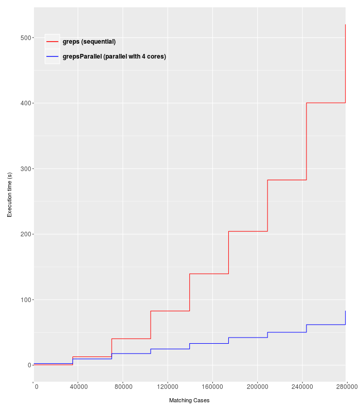
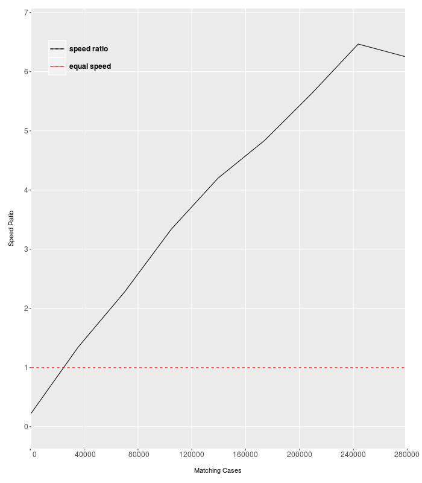

<style>
    body {
          max-width: 800px;
          margin: auto;
          padding: 1em;
          line-height: 20px; 
    }
</style>

```{r setup, include = FALSE}
knitr::opts_chunk$set(
  collapse = TRUE,
  comment = "#>"
)
```

greps-style functions form a key aspect of the `demystas` package. These functions assist with matching vectors of strings or keywords in order to deliver the best possible matchings. The three greps-style functions that we offer are:

1. `greps`: sequential string mapping
2. `grepsParallel`: parallel string mapping for large vectors
3. `grepsAbb`: sequential abbrevation to complete word mapping

## 1. `greps` function

### Basic functionality

Assume we have two vectors containing strings, here `x` and `y`.These vectors are included in the `/inst/extdata` directory of this R package and can be accessed as such:

```{r, echo=TRUE, eval=TRUE}
x <- read.csv(system.file("extdata", "sample1.csv", package = "demystas"), stringsAsFactors = FALSE)[337:347,1]

y <- read.csv(system.file("extdata", "sample2.csv", package = "demystas"), stringsAsFactors = FALSE)[c(29:35,553,737),1]
```

`x` shows an excerpt of a model's input data (e.g. REMIND). `y` represents an excerpt of REMIND model output. Our goal is to create some mappings from `x` to `y` in order to compare parameters and conduct validations. 

Here is what `x` and `y` look like:

```{r, echo=FALSE, results='asis'}
new <- data.frame(matrix(ncol = 2, nrow = 0))
new[1:length(x),1] <- x
new[1:length(y),2] <- y
names(new) <- c("x", "y")
knitr::kable(new)
```

Here, we can see keywords in `x` are separated by the character `"."` and keywords in `y` are separated by the character `"|"`. We can input these parameters into the `greps` function as regex-style expressions.

```{r, echo=TRUE, eval = FALSE}
test <- demystas::greps(x, y, sepx = "\\.", sepy = "\\|")
```

The functions produces a list with 2 matrices. The first matrix contains mappings from `x` to `y` and the second contains the respective matching scores in descending order for easy reading. Take a look:

```{r, echo=FALSE, results='hide'}
test <- demystas::greps(x, y, sepx = "\\.", sepy = "\\|")
```
```{r, echo=TRUE, eval = FALSE, results='markup'}
View(test[[1]])
```
```{r, echo=FALSE, results='asis'}
knitr::kable(test[[1]])
```
```{r, echo=TRUE, eval = FALSE, results='markup'}
View(test[[2]])
```
```{r, echo=FALSE, results='asis'}
knitr::kable(test[[2]])
```

With these results, a human could then begin parsing the data row-by-row in order to select truly relevant or similar mappings. This algorithm naturally cannot provide a complete solution for mapping purposes, but it narrows down the search space for a human to do the more "intelligent" work.

### Advanced functionality

The `greps` functions contains some parameters to tweak the matching process based on the user's perspective. The key parameters are:

a. `limitWord`: a numerical threshold greater than or equal to 0 for entire keyword matching
b. `limitChar`: a numerical threshold between 0 and 1 for string subset-based matching
c. `wordIgnore`: a character vector of strings which should be ignored for the matching process
d. `booster`: a numerical threshold which boosts the score of well-matched sub-strings. This value should be greater than `limitChar` to provide meaningful results.
e. `checkBoth`: a logical indicating whether both left and right grep-analyses should be conducted 
f. `ignore.case`: a logical indicating if the R internal grep function should match strings by ignoring cases

For brevity, we will go through `limitWord`, `limitChar` and `wordIgnore`.

#### a. `limitWord`

As per the previous example, if we want to filter keywords which have a matching score greater than `0.17`, we can execute the following:

```{r, echo=TRUE, eval = FALSE}
test <- demystas::greps(x, y, sepx = "\\.", sepy = "\\|", limitWord = 0.17)
```
```{r, echo=FALSE, results='hide'}
test <- demystas::greps(x, y, sepx = "\\.", sepy = "\\|", limitWord = 0.17)
```
```{r, echo=TRUE, eval = FALSE, results='markup'}
View(test[[1]])
```
```{r, echo=FALSE, results='asis'}
knitr::kable(test[[1]])
```
```{r, echo=TRUE, eval = FALSE, results='markup'}
View(test[[2]])
```
```{r, echo=FALSE, results='asis'}
knitr::kable(test[[2]])
```

Here, we see a smaller matrix of matchings with matching scores above 0.17. This might be useful for filtering purposes.

#### b. `limitChar`

As per the result above, we notice that "Xport.seel.waste" matches to "Emi|SO2|Land Use|Agricultural Waste Burning" due to the substring "waste" matching the substring "Agricultural Waste Burning" respectively. In our perspective, this would be considered a redundant match and we would want to remove such cases. To do this, we can set the threshold for string-subset matchings to be higher. This corresponds to the `limitChar` parameter.

In this case, we can increase `limitChar` from its default value of 0 to 0.5.

```{r, echo=TRUE, eval = FALSE}
test <- demystas::greps(x, y, sepx = "\\.", sepy = "\\|", limitWord = 0.17, limitChar = 0.5)
```
```{r, echo=FALSE, results='hide'}
test <- demystas::greps(x, y, sepx = "\\.", sepy = "\\|", limitWord = 0.17, limitChar = 0.5)
```
```{r, echo=TRUE, eval = FALSE, results='markup'}
View(test[[1]])
```
```{r, echo=FALSE, results='asis'}
knitr::kable(test[[1]])
```
```{r, echo=TRUE, eval = FALSE, results='markup'}
View(test[[2]])
```
```{r, echo=FALSE, results='asis'}
knitr::kable(test[[2]])
```

Consequently, we observe that the redundant "Emi|SO2|Land Use|Agricultural Waste Burning" match disappears.

**Note: The user should be conservative with the `limitChar` and `limitWord` values, as high values can also result in no matchings at all!**

#### c. `wordIgnore`

We can notice here that the top match for components such as "Xport.other" and "Xport.seso.other" is "Energy Investments|Other". This is due to a perfect match of the string "other" on both sides. This would not be necessarily desirable from the human's perspective, since the substring "other" is ambiguous. If we want to stop the algorithm from successfully matching the string "other", we can input this into the `wordIgnore` parameter.

```{r, echo=TRUE, eval = FALSE}
test <- demystas::greps(x, y, sepx = "\\.", sepy = "\\|", limitWord = 0.15, limitChar = 0.5, wordIgnore = c("other"))
```
```{r, echo=FALSE, results='hide'}
test <- demystas::greps(x, y, sepx = "\\.", sepy = "\\|", limitWord = 0.15, limitChar = 0.5, wordIgnore = c("other"))
```
```{r, echo=TRUE, eval = FALSE, results='markup'}
View(test[[1]])
```
```{r, echo=FALSE, results='asis'}
knitr::kable(test[[1]])
```
```{r, echo=TRUE, eval = FALSE, results='markup'}
View(test[[2]])
```
```{r, echo=FALSE, results='asis'}
knitr::kable(test[[2]])
```

With this, we can observe that the matched string "Energy Investments|Other" disappears because its substring "other" is now being ignored, which leads to no successful matching. The resulting matrix produces matchings which are probably more relevant to the human.

## 2. `grepsParallel` function

This function has the exact same functionalities as the `greps` function, except it can be executed in a parallel manner instead of a sequential manner. This is particularly useful for conducting keyword mappings on large vectors sets by reducing the time required for computation. Naturally, this is also useful for execution on a cluster.

The only additional parameter here is `noCores`, where the user specifies the number of cores to be used for parallel computation.

As a simple example, consider the two following vectors `x` and `y`:

```{r, echo=TRUE, eval=FALSE}
x <- read.csv(system.file("extdata", "sample1.csv", package = "demystas"), stringsAsFactors = FALSE)[1:100,1]

y <- read.csv(system.file("extdata", "sample2.csv", package = "demystas"), stringsAsFactors = FALSE)[1:300,1]
```

To match the keywords through our `greps` functions, we need to process 100 x 300 x 2 = 60,000 cases. Here we compare the sequential `greps` functions in `test1` against the parallel `grepsParallel` function in `test2`.

```{r, echo=TRUE, eval=FALSE}
test1 <- demystas::greps(x, y, sepx = "\\.", sepy = "\\|")

test2 <- demystas::grepsParallel(x, y, noCores = 4, sepx = "\\.", sepy = "\\|")
```
```{r, echo=FALSE, results='asis'}
new <- data.frame(matrix(ncol = 3, nrow = 0))
new[1,1] <- "84.441s"
new[1,2] <- "18.761s"
new[1,3] <- 84.441/18.761
names(new) <- c("greps", "grepsParallel", "speedRatio (par:seq)")
knitr::kable(new)
```

In this case given `x` and `y`, we can see that the `grepsParallel` function is ~4.5 times faster than the corresponding `greps` function.

Below, we plotted the execution time required for the sequential `greps` algorithm (red) against that of the parallel `grepsParallel` algorithm (blue). 

We essentially kept `x` at its maximum length and increased the length of `y` incrementally. Here, we can see that the sequential algorithm performs slightly better than the parallel algorithm until ~30,000 matching cases, After this, significant improvements in execution time manifest for the parallel algorithm. 

```{r echo=FALSE, out.width='70%', fig.align='center'}

```

This can also be visualized by the speed ratio (black) of the parallel algorithm compared to the sequential algorithm. The benefits of the parallel algorithm appear to manifest at around ~30,000 matching cases. This is of course a subjective analysis; and the exact results would vary depending on the exact components of `x` and `y`.

```{r echo=FALSE, out.width='70%', fig.align='center'}

```

## 3. `grepsAbb` function

The `grepsAbb` function essentially maps abbreviations to whole words using a logical mapping alogrithm. A useful example could be mapping non-ISO3 country abbreviations to country names. For these cases, there is no standard to map abbreviations to words, and therefore we could use the `grepsAbb` algorithm.

Here, we consider the following datasets:

```{r, echo=TRUE, eval=TRUE}
abb <- read.csv(system.file("extdata", "sample4.csv", package = "demystas"), stringsAsFactors = FALSE)[,1]

words <- read.csv(system.file("extdata", "sample3.csv", package = "demystas"), stringsAsFactors = FALSE)[,1]
```
```{r, echo=FALSE, results='asis'}
new <- data.frame(matrix(ncol = 2, nrow = 0))
new[1:length(abb),1] <- abb
new[1:length(words),2] <- words
names(new) <- c("abb", "words")
knitr::kable(new)
```

We will now apply the algorithm as below. The result will be a matrix of possible matchings.

```{r, echo=TRUE, eval = TRUE, results='hide'}
test <- demystas::grepsAbb(abb, words)
```
```{r, echo=FALSE, results='asis'}
knitr::kable(test)
```

This matrix narrows down the mappings, allowing the human to perform the remaining "intelligent" selections to complete the mapping.
