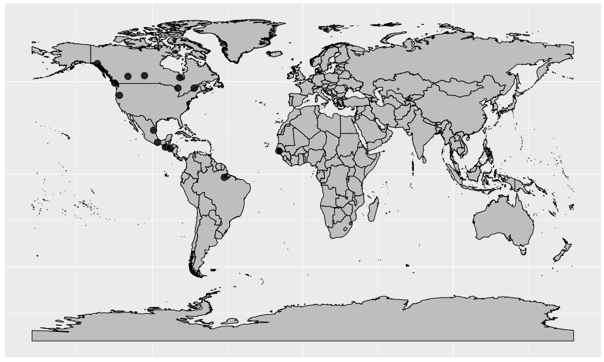
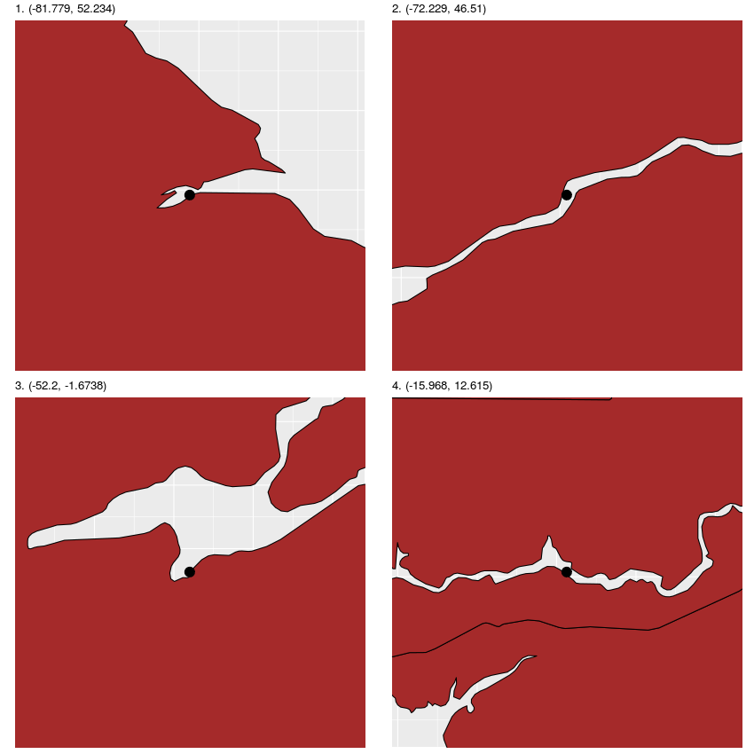

<style>
    body {
          max-width: 800px;
          margin: auto;
          padding: 1em;
          line-height: 20px; 
    }
</style>

```{r setup, include = FALSE}
knitr::opts_chunk$set(
  collapse = TRUE,
  comment = "#>"
)
```

Other than greps-type functions, `demystas` provides other interesting and useful functions which fall under the categories of spatial querying and vector enumeration. Following are the key functions:

1. `coords2spi`: a lightly modified wrapper function for `sp::over` which overlays coordinates of class data frame, SpatialPoints or SpatialPointsDataFrame onto a global polygon of class SpatialPolygonsDataFrame.

2. `spNearest`: a largely modified wrapper function for `geosphere::dist2Line` which is used to complement the `coords2spi` function by finding the nearest polygon to points that do not lie directly on a polygon. This function should be used on unprojected coordinates ie. lon/lat, ideally with the WGS84 ellipsoid.

3. `vectorEnum`: uniquely enumerates a vector's components regardless of the order or distribution of duplicated components. Useful for cases where duplicate components of vectors are not permitted and exact order must be preserved.

## 1. `coords2spi` function

This function is a wrapper function for `sp::over`, which essentially overlays points of classes data frame, SpatialPoints or SpatialPointsDataFrame onto a global polygon of class SpatialPolygonsDataFrame.

Assume we are trying to map the following 14 longitude/latitude coordinates onto a global map to find out which countries they belong to. These points could represent possible potential hydro-powerplant locations.

```{r, echo=TRUE, eval=TRUE}
coords <- read.csv(system.file("extdata", "sample5.csv", package = "demystas"), stringsAsFactors = FALSE)
```
```{r, echo=FALSE, results='asis'}
knitr::kable(coords, row.names = TRUE)
```

We can visualize these coordinates as follows on a world map.

```{r echo=FALSE, out.width='100%', fig.align='center'}

```

We would like to overlay these points onto the `global` polygon and retrieve information regarding their intersection. Here is how we could perform this action. Since `coords` is not projected, the `coords2spi` function will assume that `coords` and `global` share the same CRS/Projection.

```{r, echo=TRUE, eval=FALSE}
library(rworldmap)
library(rworldxtra)
global <- getMap(resolution="high")

results <- demystas::coords2spi(coords, global)
```

Now, let's view the countries to which the points belong to.

```{r, echo=TRUE, eval=FALSE}
results$ADMIN
```
```{r, echo=FALSE, eval=TRUE}
knitr::kable(c(rep("Canada", 2), "United States of America", rep("Canada", 2), rep("Mexico", 2), "Guatemala", "El Salvador", "Canada", rep(NA,4)), row.names = TRUE)
```

Here, we can see that 10 out of 14 coordinates in `coords` have been mapped onto a country. The remaining 4 points lie outside the global polygon and cannot be mapped. We will discuss the issue of these remaining 4 points in the next section. But first, a key point to ponder below.

### What is the advantage of demystas::coords2spi over sp::over?

Simply put, the only valid input data for the points in `sp::over` are SpatialPoints or SpatialPointsDataFrame. For the `coords2spi` wrappper function, the user has an increased convenience of inputting a data frame of coordinates which are assumed to be of the same CRS/Projection as the global SpatialPolygonsDataFrame object provided. The function will automatically assign the global object's CRS to the coordinates and will then conduct the `sp::over` algorithm. This could save time in manually assigning a CRS/Projection to points in a data frame.

## 2. `spNearest` function

We now return back to our previous problem where we were unable to map 4 out of 14 longitude/latitude coordinates in `coords`. Let's review these coordinates.

```{r, echo=TRUE, eval=TRUE}
coords <- read.csv(system.file("extdata", "sample5.csv", package = "demystas"), stringsAsFactors = FALSE)[11:14,]
```
```{r, echo=FALSE, results='asis'}
row.names(coords) <- NULL
knitr::kable(coords, row.names = TRUE)
```

To get a sense of why these points cannot be mapped onto a global polygon, let's visualize these 4 points on maps.

```{r echo=FALSE, out.width='90%', fig.align='center'}

```

We can see that these points lie just off the coast/borders of a country (red). As a result, they do not intersect the polygon of the country and cannot be successfully captured via the `coords2spi` function. In order to overcome this issue, we introduce the `spNearest` function. This function is a wrapper function for the `geosphere::dist2Line` function.

The algorithm within the function finds the nearest polygon to the point and returns the information regarding the nearest polygon. With this, we can find out to which country these "lone" points most likely belong to.

```{r, echo=TRUE, eval=FALSE}
library(rworldmap)
library(rworldxtra)
global <- getMap(resolution="high")

results <- demystas::spNearest(coords, global)
```

Let's view the results of this run.

```{r, echo=TRUE, eval=FALSE}
results$ADMIN
```
```{r, echo=FALSE, eval=TRUE}
knitr::kable(c(rep("Canada", 2), "Brazil", "Senegal"), row.names = TRUE)
```

And we have now managed to map the remaining 4 points to countries!

`coords2spi` and `spNearest` represent spatial query functions in demystas which can be used in complement as shown in our examples. This above-described methodology has been tested with existing hydro-power datasets, which will soon be used in the REMIND model.

Before continuing, here are some points to ponder about below.

### What is the advantage of demystas::spNearest over geosphere::dist2Line?

Finding the nearest global polygon to a point using only `geosphere::dis2Line` can be a timely process due to the sheer size and number of computations given the size of the world map in `global`. The `spNearest` algorithm overcomes this efficiency issue by buffering the world map based on each point and then calculating the nearest polygon. 

In order to prevent errors of having too small buffers or invalid buffers due to complex line intersections, the `spNearest` algorithm has an in-built `while` loop which catches errors and warning messages and adjusts buffer sizes based on these such that the algorithm flows smoothly. The greatest advantage of the `spNearest` wrapper algorithm is therefore its efficiency

### What is a disadvantage of demystas::spNearest?

Due to the internal `geosphere::dist2Line` function, the `spNearest` function can only be used with unprojected lon/lat coordinates, ideally on a WGS84 ellipsoid. If another ellipsoid is being used, it might be helpful to read more about the distance calculation function of `geosphere::dist2Line`.

```{r, echo=TRUE, eval=FALSE}
??geosphere::dist2Line
```

Alternatively, if projected coordinates are being used, then another function optimized for projected coordinates such as `rgeos::gDistance` should be used.

```{r, echo=TRUE, eval=FALSE}
??rgeos::gDistance
```

## 3. `vectorEnum` function

Finally, we come to the `vectorEnum` function. This is a comparatively simpler function compared to the previous two. Assume we have the following containing ISO3 country names.

```{r, echo=TRUE, eval=TRUE}
x <- c(rep("SRB", 5), rep("CZE", 5), rep("SRB", 2), rep("VAT", 3), rep("CZE", 4), rep("NER", 2))
```
```{r, echo=FALSE, eval=TRUE}
knitr::kable(x)
```

The vector `x` has multiple duplicates and is therefore not unique. Assume we want to preserve the order of `x` and create a magpie object from this dataset. Naturally, we might come across some errors due to the presence of duplicates. There are several ways to fix this issue and to create a unique vector from `x`.
  
One method is to simply enumerate all components in ascending natural numbers. 

```{r, echo=TRUE, eval=TRUE}
x1 <- paste0(x, ".", 1:length(x))
```
```{r, echo=FALSE, eval=TRUE}
knitr::kable(x1)
```

This method would work in making `x` unique and in preserving the order of `x`. However, we lose information about the exact numbers of each unique element. If we choose to order the dataset later alphabetically, we come across disorderly results.

```{r, echo=TRUE, eval=TRUE}
x2 <- x1[order(nchar(x1), x1)]
```
```{r, echo=FALSE, eval=TRUE}
knitr::kable(x2)
```

Here, ordered ISO3 names do not have consistent numbers indicating their indices based on unique elements. 

To overcome this problem, we introduce the `vectorEnum` function. This function makes `x` unique, preserves its original order and allows for consistent enumeration if the vector is alphabetically sorted at a later point in time. 

```{r, echo=TRUE, eval=TRUE}
x3 <- demystas::vectorEnum(x) 
```
```{r, echo=FALSE, eval=TRUE}
knitr::kable(x3)
```

Let's try sorting this vector alphabetically.

```{r, echo=TRUE, eval=TRUE}
x4 <- x3[order(nchar(x3), x3)]
```
```{r, echo=FALSE, eval=TRUE}
knitr::kable(x4)
```

Here, we can see that the ordered ISO3 country names are enumerated consistently based on their unique element. This would be a desirable result.
